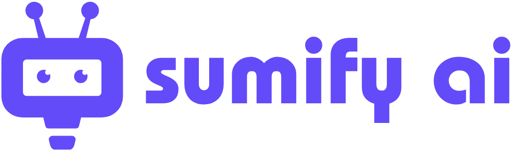

# Sumify AI

<p align="center">
  
</p>

<p align="center">
  
  
  
  
  
  
  
  
</p>

## Daftar Isi
- [Deskripsi](#deskripsi)
- [Project Ini Apa](#project-ini-apa)
- [Fitur](#fitur)
- [Arsitektur](#arsitektur)
- [Struktur Proyek](#struktur-proyek)
- [Dokumentasi](#dokumentasi)
- [Tech Stack](#tech-stack)
- [Permission](#permission)
- [Prasyarat](#prasyarat)
- [Build](#build)
- [Cara Fork dan Copy Project](#cara-fork-dan-copy-project)
- [Kontribusi](#kontribusi)
- [Lisensi](#lisensi)
- [Catatan](#catatan)

## Deskripsi
Sumify AI adalah aplikasi Android untuk merekam atau mengunggah audio rapat, lalu memprosesnya menjadi ringkasan, transkrip, dan file PDF hasil pemrosesan. Aplikasi ini mendukung mode demo untuk simulasi alur kerja tanpa backend aktif, serta mode online untuk terhubung ke API eksternal.

## Project Ini Apa
Project ini adalah client mobile untuk workflow pembuatan meeting summary. Fokus utamanya ada pada:
- perekaman audio langsung dari aplikasi
- pemilihan file audio dari perangkat
- upload audio ke server
- pemantauan status pemrosesan meeting
- penyimpanan riwayat lokal
- pengelolaan hasil favorit dan download PDF

## Fitur
- Welcome screen dengan status onboarding yang disimpan lokal
- Dashboard untuk akses utama ke pembuatan summary, riwayat favorit, dan settings
- Rekam audio langsung dari mikrofon
- Pilih file audio dari storage perangkat
- Upload audio beserta metadata: judul, deskripsi, dan bahasa
- Mode demo untuk simulasi proses transkripsi dan summarization
- Polling status meeting sampai selesai
- Detail meeting berisi transcript, summary, dan link PDF
- Simpan riwayat meeting secara lokal
- Tandai meeting sebagai favorit
- Hapus meeting dari riwayat
- Unduh file PDF ke folder Downloads
- Konfigurasi base URL API dari aplikasi
- Test koneksi server dari settings

## Arsitektur
Proyek ini memakai pola **Single-Activity + Jetpack Compose + MVVM**.

Alur utamanya:
1. `MainActivity` menjadi entry point tunggal.
2. `MainViewModel` memegang state aplikasi, upload, recording, polling, dan preferensi.
3. `Navigation` mengatur perpindahan antar screen.
4. Layer data menangani:
   - `ApiConfig` untuk Retrofit client
   - `SumifyApiService` untuk endpoint backend
   - `LocalHistoryManager` untuk riwayat lokal berbasis JSON file
   - `AppPreferencesManager` untuk DataStore preferences
5. UI Compose membaca state dari ViewModel dan menampilkan screen sesuai kondisi.

### Komponen Utama
- `app/src/main/java/id/antasari/sumifyai/MainActivity.kt`
- `app/src/main/java/id/antasari/sumifyai/ui/viewmodel/MainViewModel.kt`
- `app/src/main/java/id/antasari/sumifyai/ui/navigation/Navigation.kt`
- `app/src/main/java/id/antasari/sumifyai/data/api/ApiConfig.kt`
- `app/src/main/java/id/antasari/sumifyai/data/api/SumifyApiService.kt`
- `app/src/main/java/id/antasari/sumifyai/data/local/LocalHistoryManager.kt`
- `app/src/main/java/id/antasari/sumifyai/data/local/AppPreferencesManager.kt`

## Struktur Proyek
```text
app/
  src/main/java/id/antasari/sumifyai/
    MainActivity.kt
    data/
      api/
      local/
      model/
    ui/
      components/
      navigation/
      screens/
      theme/
      viewmodel/
    utils/
commonMain/
docs/architecture/
```

## Diagram Arsitektur
Dokumentasi visual tersedia di:
- `docs/architecture/System Architecture Diagram.png`
- `docs/architecture/UML Sequence Diagram.png`

## Dokumentasi
### Alur Penggunaan
1. Buka aplikasi.
2. Lewati welcome screen saat pertama kali masuk.
3. Masuk ke dashboard.
4. Rekam audio atau pilih file audio dari perangkat.
5. Isi judul, deskripsi, dan bahasa.
6. Upload audio untuk diproses.
7. Pantau status meeting sampai selesai.
8. Buka detail meeting untuk melihat summary, transcript, dan PDF.

### Konfigurasi Backend
- Buka `Settings`.
- Ubah base URL API sesuai server yang dipakai.
- Jalankan `Test Connection` untuk memastikan backend aktif.
- Gunakan mode demo jika ingin simulasi tanpa backend.

### Referensi File Penting
- `app/src/main/java/id/antasari/sumifyai/MainActivity.kt`
- `app/src/main/java/id/antasari/sumifyai/ui/navigation/Navigation.kt`
- `app/src/main/java/id/antasari/sumifyai/ui/viewmodel/MainViewModel.kt`
- `app/src/main/java/id/antasari/sumifyai/data/api/ApiConfig.kt`
- `app/src/main/java/id/antasari/sumifyai/data/local/LocalHistoryManager.kt`

## Tech Stack
- Android
- Kotlin
- Jetpack Compose
- Material 3
- Navigation Compose
- ViewModel
- DataStore Preferences
- Retrofit
- OkHttp
- Gson
- Gradle Kotlin DSL

## Permission
Aplikasi ini menggunakan permission:
- `INTERNET`
- `RECORD_AUDIO`
- `MODIFY_AUDIO_SETTINGS`

## Prasyarat
- Android Studio terbaru yang mendukung proyek Android Gradle Kotlin DSL
- JDK 11
- Android SDK sesuai `compileSdk` dan `targetSdk`
- Backend API jika ingin memakai mode online

## Build
Jalankan dari Android Studio atau via Gradle:
```bash
./gradlew assembleDebug
```

## Cara Fork dan Copy Project
### Fork
1. Buka repository ini di GitHub.
2. Klik tombol `Fork`.
3. Pilih akun atau organisasi tujuan.
4. Clone repository hasil fork ke komputer lokal.

### Copy / Clone
```bash
git clone <url-repository>
cd sumifyai
```

### Jalankan Setelah Copy
1. Buka project di Android Studio.
2. Sinkronkan Gradle.
3. Sesuaikan base URL backend di `Settings` bila perlu.
4. Jalankan aplikasi di emulator atau device.

## Kontribusi
Kontribusi terbuka untuk perbaikan fitur, bugfix, dan dokumentasi. Panduan lengkap tersedia di [`CONTRIBUTING.md`](CONTRIBUTING.md).

### Alur Kontribusi
1. Fork repository ini.
2. Buat branch baru untuk perubahan.
3. Kerjakan perubahan yang dibutuhkan.
4. Pastikan project tetap berhasil di-build.
5. Push branch ke repository fork.
6. Buat Pull Request ke repository utama.

### Panduan Singkat
- Ikuti struktur kode yang sudah ada.
- Hindari perubahan yang tidak terkait dengan task.
- Sertakan penjelasan singkat pada Pull Request.
- Jika ada perubahan perilaku, tambahkan dokumentasi seperlunya.

### Format Pull Request
Gunakan ringkasan singkat seperti:
```text
Judul: Fix upload flow on dashboard

Perubahan:
- memperbaiki alur upload
- menambah validasi input
- memperjelas pesan error
```

Template Pull Request dan Issue juga tersedia di folder `.github`.

## Lisensi
Lisensi project belum ditentukan. Tentukan lisensi sebelum project dipublikasikan atau digunakan ulang oleh pihak lain.

## Catatan
Base URL API bisa diubah dari menu settings. Default endpoint saat berjalan di emulator mengarah ke `http://10.0.2.2:8000/`.
